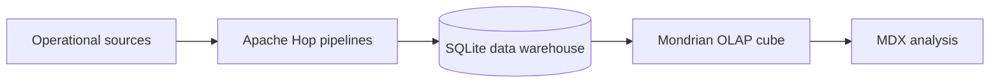

# Data Warehouse, ETL, and OLAP Analysis

Data engineering project covering the construction of an analytical data warehouse from operational sources through to multidimensional OLAP analysis.

The project combines Apache Hop ETL pipelines, SQLite, a Mondrian cube, and MDX queries.

## Architecture



## Main components

### ETL and data warehouse

The `projet_hop/projet_hop` directory contains:

- `datawarehouse.txt`: SQL schema for the analytical warehouse
- `pipeline1.hpl`, `pipeline2.hpl`, `pipeline3.hpl`: Apache Hop ingestion and transformation pipelines
- `data_in/`: dates, geographic data, services, and the operational database
- `data_out/datawarehouse.db`: generated SQLite warehouse
- `data_out/Errors.csv.txt`: rejected or invalid rows captured during loading

The warehouse organizes sales facts around client, service, date, and location dimensions.

### OLAP analysis

The `tp_olap` directory contains:

- the generated `datawarehouse.db`
- the Mondrian XML schema
- exercise configuration files
- individual MDX queries from `ex2.mdx` to `ex11.mdx`
- a small viewer for displaying query results

## Technologies

Apache Hop · SQLite · SQL · ETL · Data Warehousing · Multidimensional Modeling · Pentaho Mondrian · OLAP · MDX

## Repository structure

```text
projet_hop/
  projet_hop/
    data_in/             Operational input sources
    data_out/            Generated warehouse and error report
    datawarehouse.txt    Warehouse SQL schema
    pipeline*.hpl        Apache Hop pipelines
  diagramme.png          Warehouse schema

tp_olap/
  datawarehouse/         SQLite warehouse used by Mondrian
  exercices/             Mondrian configuration and MDX queries
  lib/                   OLAP viewer dependencies
  run.sh                 Query execution script
```

## Running an MDX query

From the `tp_olap` directory, replace the query filename with the analysis you want to execute:

```bash
sh run.sh -p exercices/exercice.properties -f exercices/ex9.mdx \
  | java -jar lib/mondrian_view.jar
```

## Learning outcomes

- Design a dimensional analytical schema
- Build reproducible ETL workflows from heterogeneous sources
- Track rejected records during ingestion
- Construct and query a multidimensional cube
- Translate analytical questions into MDX queries

## Context

Completed as part of the Advanced Databases course in the Master's degree in Artificial Intelligence at the University of Caen Normandy.
